# Linkefree

**Accessible project link: <a href="https://linkefree.onrender.com/">Linkefree</a>**

## Summary

1. [What it is](#what-it-is)
2. [Folders](#folders)
3. [Running the application locally](#running-the-application-locally)
4. [Preview](#preview)

## What it is

The program is a platform for creating a "Link in Bio" page. With it you can easily create your own page, with links to different social media. The site has a registration and login system, password recovery and is completely responsive to different screen sizes, developed entirely with <a href="https://tailwindcss.com/">Tailwind CSS</a>.

> Program developed in my native language (Portuguese).

### Technologies and libraries used :

- HTML, CSS, JavaScript
- Tailwind CSS
- Node.js
- MongoDB
- Express
- handlebars
- mongoose
- bcrypt
- passport
- connect-flash
- express-session
- uuid
- Nodemailer

## Folders

- **/src/config:** Defines project settings
- **/src/controllers:** Defines the request handling functions
- **/src/helpers:** Defines recurring auxiliary functions
- **/src/models:** Defines models for storage in the Database
- **/src/routes:** Defines API routes
- **/src/services:** Defines specific files for handling the Database
- **/src/views:** Defines the application's view pages
- **/src/public:** Defines the project's static files

## Running the application locally

1. First, make sure you have <a href="https://nodejs.org/en">Node.js</a> installed on your machine.

   > Program developed in version 18.12.1 on Node.js.

2. To run the project, you need to create a file called ".env" in the root directory, paste the lines below into this file and replace the strings with their respective information:

   ```bash
       DB_PASSWORD='<YOUR-MONGODB-DATABASE-URI>'
       USER_EMAIL="<EMAIL-TO-SEND-THE-PASSWORD-RECOVERY-CODE>"
       USER_PASSWORD="<ACCOUNT-PASSWORD>"
       SESSION_KEY="<SECRET-KEY-FOR-SESSION>"
   ```

   > ACCOUNT-PASSWORD: You need to <a href="https://myaccount.google.com/apppasswords">generate</a> a password to access the API.

3. Then run the “start.bat” file in the root directory.

## Preview :

#### Desktop

<table width="100%"> 
<tr>
<td width="50%">
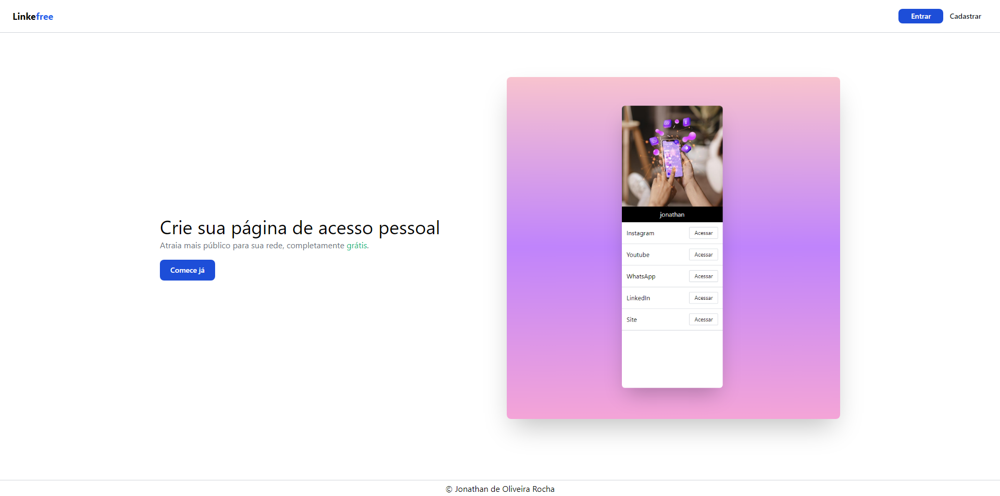
</td> 
<td width="50%">
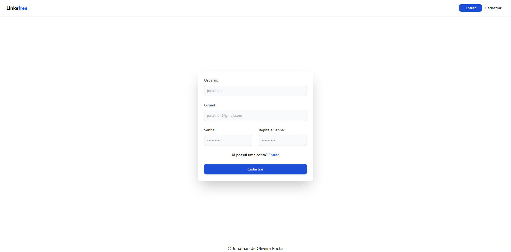
</td> 
</tr>
<tr>
<td width="50%">
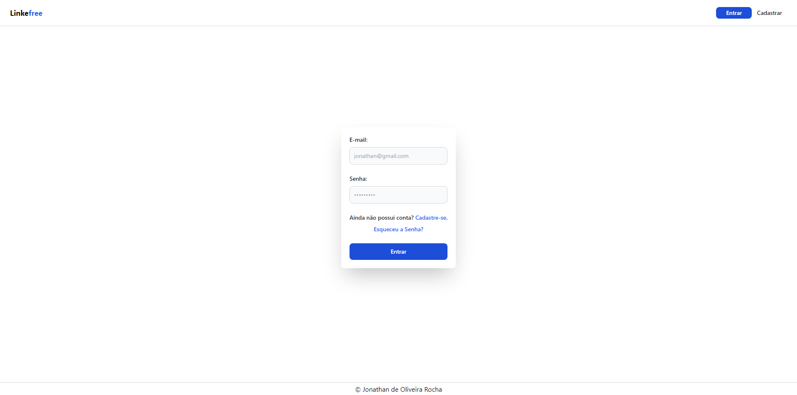
</td> 
<td width="50%">
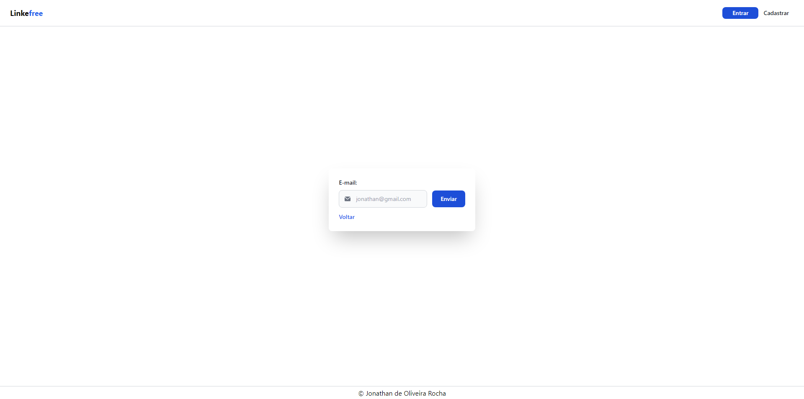
</td> 
</tr>
<tr>
<td width="50%">
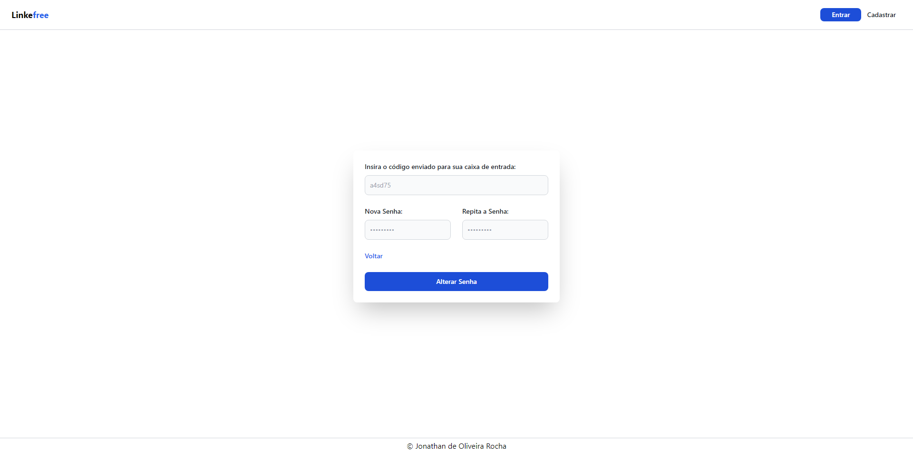
</td> 
<td width="50%">
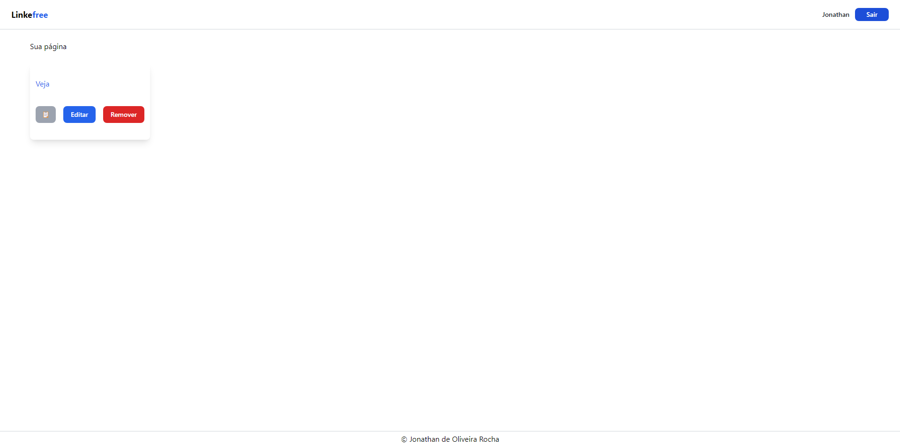
</td> 
</tr>
<tr>
<td width="50%">
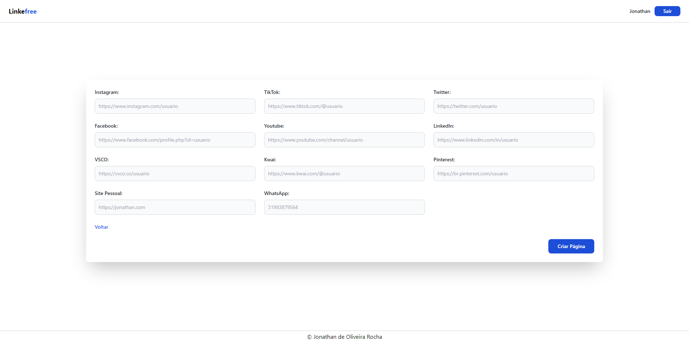
</td> 
<td width="50%">

</td> 
</tr>
<tr>
<td width="50%">
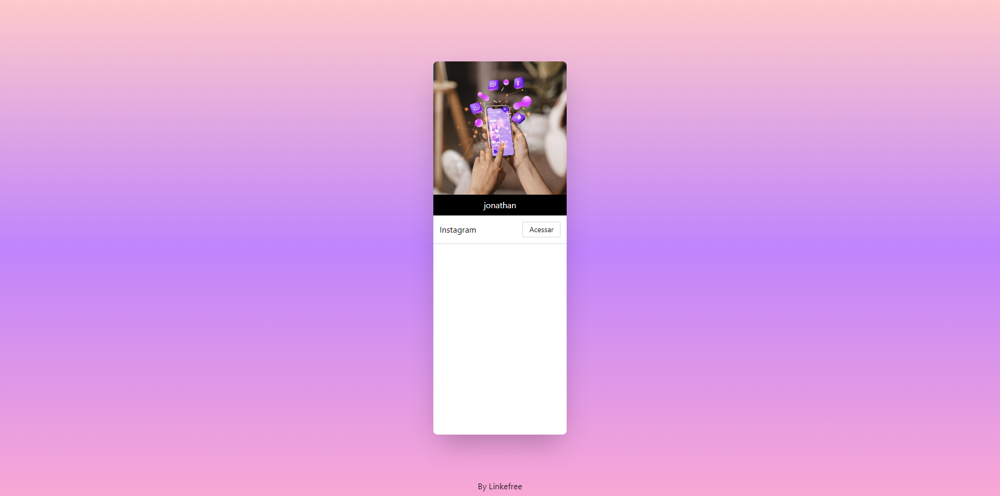
</td> 
</tr>
</table>

#### Mobile

<table width="100%"> 
<tr>
<td width="25%">
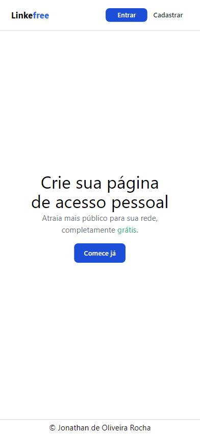
</td> 
<td width="25%">
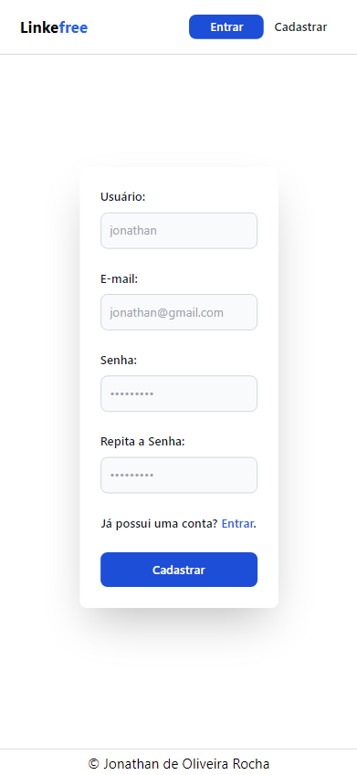
</td> 
<td width="25%">
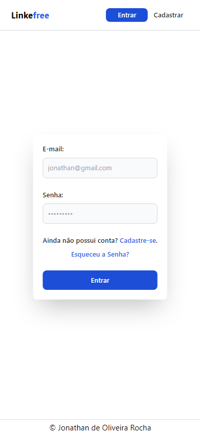
</td> 
<td width="25%">
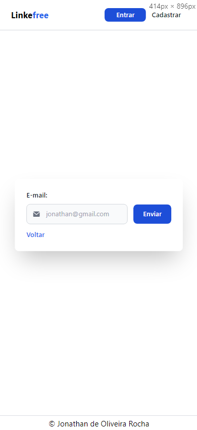
</td> 
</tr>
<tr>
<td width="25%">
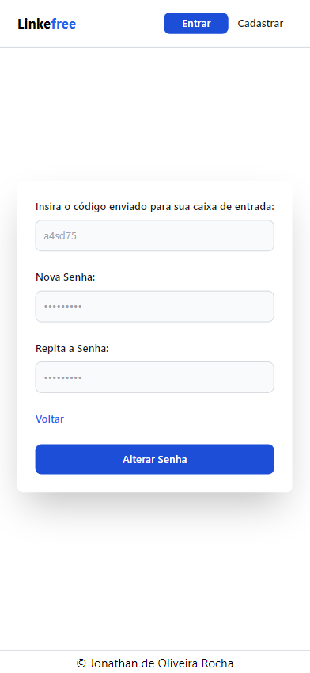
</td> 
<td width="25%">
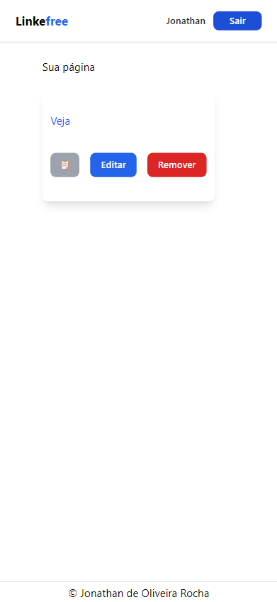
</td> 
<td width="25%">

</td> 
<td width="25%">
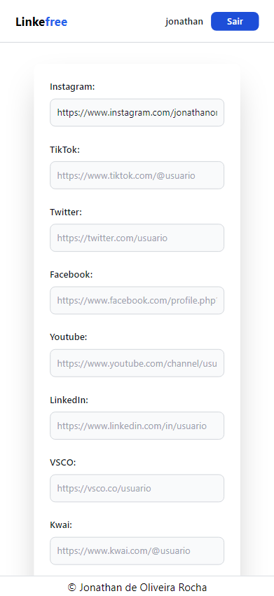
</td> 
</tr>
<tr>
<td width="25%">
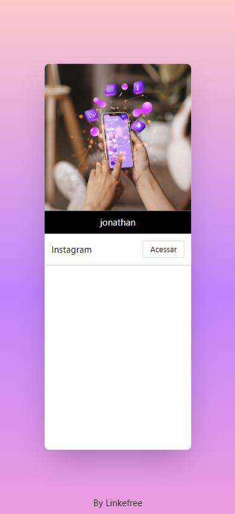
</td> 
</table>
